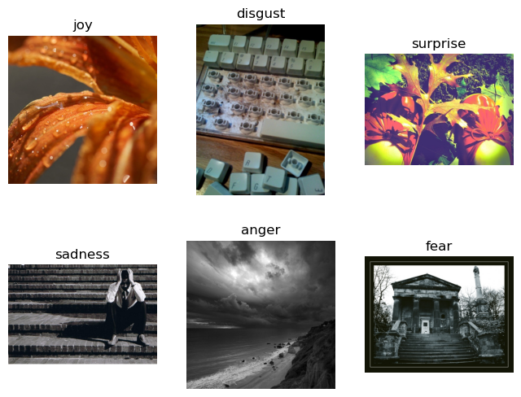

# Description
This is the code for the Kaggle competition:  
[kaggle link](https://www.kaggle.com/competitions/b3-data-information-course-vsa)  

The dataset contains images with 6 emotion labels:  
  

The task is to perform image classification.

We approach the task using an ensemble method with three different models: **Vision Transformer**, **EfficientNetV2**, and **ResNeXt**. Each of these models represents state-of-the-art performance in image classification.

The models were trained for 100 epochs, and we visualized the training loss and validation loss:  
  

Finally, we tested the models on the test dataset and visualized the confusion matrix:  

Although it is not the most optimal approach and requires further tuning, I believe using an ensemble is a good way to solve this task.